# Deribit Options Backtest Catalog — Product Specification (v1.0)

**Version:** 1.0  
**Date:** 2026-09-09  
**Status:** ACTIVE SPECIFICATION  
**Scope:** BTC Inverse Options Multi-Leg Strategy Backtesting Engine

---

## 1. Product Purpose & Objective

The **Deribit Options Backtest Catalog** is a professional quantitative research platform designed to simulate, backtest, and rigorously validate systematic option trading strategies using real historical market data from Deribit exchange **without risking real capital**.

### Primary Goal
To empower researchers to evaluate:
* Win / loss ratios and trade distribution.
* Net PnL in both native **BTC** and denominated **USD**.
* Maximum peak-to-trough drawdowns and risk metrics.
* Real data coverage and liquidity impact under authentic Deribit transaction fees and slippage.

The initial release targets **BTC inverse options** at 1-hour and 1-day decision resolutions.

---

## 2. Product Scope & Boundaries

### In-Scope (v1.0 Core Release)
1. **Asset Class:** Deribit Bitcoin Inverse Options (`BTC-*-*-*`).
2. **Contract Mechanics:**
   * Contract size = 1.0 BTC.
   * Premium quoted and settled in BTC.
   * Strike price quoted in USD.
   * Minimum tick size = 0.0005 BTC.
   * Official delivery settlement at 08:00 UTC on contract expiration date using Deribit's 30-minute TWAP delivery price.
3. **Decision & Evaluation Resolution:**
   * 1-Hour (60m) and 1-Day (24h) OHLCV trade bars and observation buckets.
   * Evaluation strictly occurs at bucket boundaries with zero lookahead bias.
4. **Strategy Flexibility:**
   * Multi-leg strategies (Long Straddle, Short Straddle, Bull/Bear Call & Put Spreads, Iron Condors, Strangle, and custom $N$-leg definitions).
   * Simultaneous symmetrical leg selection with common strike and expiry matching.
5. **Fee & Cost Modeling:**
   * Authentic Deribit fee formula: $\min(\text{amount} \times 0.0003, \text{premium\_btc} \times \text{amount} \times 0.125)$.
   * Parameterised slippage and bid/ask spread models.
6. **Accounting & Capital:**
   * Double-entry BTC cash and position ledger.
   * Separate tracking of native BTC equity and USD mark-to-market equity.
   * Benchmark comparison against 100% Buy-and-Hold BTC.
7. **Zero Cost Infrastructure:**
   * Operates 100% on public endpoints (`history.deribit.com`, `www.deribit.com`). Initial budget: **$0**.

### Out-of-Scope for v1.0 (Deferred to Subsequent Tasks 21–24)
* Non-BTC assets (ETH, SOL, USDC-settled options).
* Sub-minute or tick-level order queue execution (Model D L2 replay is defined in Task 21–22).
* Complex exchange cross-margin engines (v1 uses conservative stress reserves for short positions).

---

## 3. Workflow Architecture

```mermaid
flowchart LR
    A["RunConfig (Start, End, Strategy)"] --> B["Contract Universe (Historical Catalog)"]
    B --> C["Contract Selector (ATM / DTE Matching)"]
    C --> D["Signal Engine (Entry & Exit Rules)"]
    D --> E["Execution Model (Fill Simulation)"]
    E --> F["BTC Ledger & Portfolio State"]
    F --> G["Valuation & Equity Curve"]
    G --> H["Performance Metrics & Reports"]
```

1. **Configuration:** The user specifies start/end dates, strategy name, initial BTC capital, decision resolution (1h/24h), and cost parameters.
2. **Universe Filtering:** The historical contract catalog selects eligible contracts satisfying listing and expiration time boundaries ($creation \le T < expiry$).
3. **Leg Selection:** Algorithmic matcher pairs identical strike/expiry Call and Put legs for straddles with deterministic tie-breaking.
4. **Bar Processing:** The engine steps hour-by-hour through the observation window. Signals are evaluated on completed bars.
5. **Execution & Fills:** Orders are simulated against subsequent market observations using the chosen execution model.
6. **Accounting & Settlement:** Fills update the BTC ledger. Expired contracts are exercised/settled against the official delivery price.
7. **Reporting:** Full equity curves, drawdown statistics, per-trade PnL logs, and data coverage metrics are written to immutable report manifests.

---

## 4. Execution & Cost Models

| Model ID | Name | Execution Price | Liquidity Requirement | Use Case |
|---|---|---|---|---|
| `model_a_bid_ask` | Historical Bid/Ask | Buy at Ask, Sell at Bid | Requires valid bid/ask quotes | Conservative baseline |
| `model_b_mid_slippage` | Mid + Slippage | Mid price $\pm$ configured slippage | Requires valid trade or quotes | Sensitivity testing |
| `model_c_trade_bar_close` | Trade Bar Close | Fills at bar close price | Requires real traded volume | Volume-validated backtest |
| `model_d_quote_l2` | Order Book L2 | Queue position & depth fill | Requires full L2 snapshots | Advanced execution (v2) |

---

## 5. Acceptance & Quality Gates

* **Zero Lookahead:** No trading decision may utilize data available after the decision timestamp.
* **Deterministic Results:** The same inputs and random seed must produce byte-for-byte identical output manifests across independent runs.
* **Accurate Deribit Accounting:** Net PnL must strictly reflect trading fees, delivery settlement, and leg symmetry.
* **Graceful Degradation:** Market hours with zero trading volume are explicitly flagged as `observed_no_trade`, preventing false zero valuations or stale price fills.
